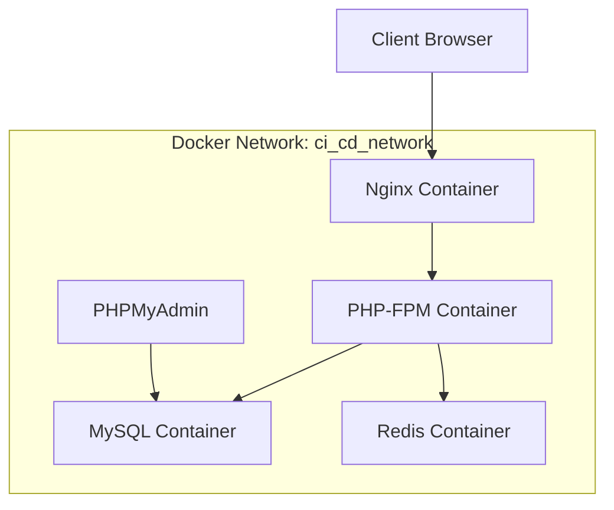

# Docker Setup Guide

This guide provides detailed instructions for setting up and managing the Docker environment for the Laravel application.

## 🐳 Docker Architecture Overview

The application uses a multi-container Docker setup with the following services:

### Service Architecture



## 📁 Docker Configuration Files

### 1. Dockerfile (`.docker/Dockerfile`)

The main Dockerfile builds a custom PHP 8.2-FPM container with Laravel dependencies:

#### Key Features:
- **Base Image**: `php:8.2-fpm`
- **Extensions**: GD, PDO MySQL, BCMath, MBString, ZIP, EXIF, PCNTL
- **Tools**: Composer, Git, Curl
- **User Management**: Custom non-root user for security
- **Optimization**: Multi-layer caching for faster builds

#### Build Arguments:
- `user`: Username for the container user
- `uid`: User ID for proper file permissions

### 2. Docker Compose Configuration

#### Environment Variables

Create a `.env` file with the following Docker-specific variables:

```env
# Application Ports
DOCKER_APP_PORT=3692          # Main application HTTP port
DOCKER_APP_SSL_PORT=3693      # Main application HTTPS port
DOCKER_DB_PORT=3694           # MySQL port
DOCKER_PHPMYADMIN_PORT=3695   # PHPMyAdmin port
DOCKER_REDIS_PORT=3696        # Redis port

# Database Configuration
DB_CONNECTION=mysql
DB_HOST=ci_cd_db              # Must match service name
DB_PORT=3306                  # Internal container port
DB_DATABASE=laravel_cicd
DB_USERNAME=laravel_user
DB_PASSWORD=secure_password

# Redis Configuration
REDIS_HOST=ci_cd_redis_cache  # Must match service name
REDIS_PASSWORD=redis_password
REDIS_PORT=6379               # Internal container port
```

#### Service Definitions

**PHP Application Service (`ci_cd`)**
```yaml
build:
  context: .
  dockerfile: .docker/Dockerfile
  args:
    user: test_app
    uid: 1000
volumes:
  - ./:/var/www                              # Source code
  - ./.docker/php/local.ini:/usr/local/etc/php/conf.d/local.ini  # PHP config
```

**Nginx Service (`ci_cd_nginx`)**
```yaml
image: nginx:alpine
volumes:
  - ./:/var/www                              # Source code
  - ./.docker/nginx/conf.d/:/etc/nginx/conf.d/  # Nginx config
  - ./.docker/nginx/certs:/etc/nginx/certs   # SSL certificates
```

**MySQL Service (`ci_cd_db`)**
```yaml
image: mysql:8.0
environment:
  MYSQL_DATABASE: ${DB_DATABASE}
  MYSQL_ROOT_PASSWORD: ${DB_PASSWORD}
  MYSQL_PASSWORD: ${DB_PASSWORD}
  MYSQL_USER: ${DB_USERNAME}
volumes:
  - ci_cd_mysql_data:/var/lib/mysql          # Persistent data
```

**Redis Service (`ci_cd_redis_cache`)**
```yaml
image: redis:alpine
command: redis-server --save 20 1 --loglevel warning --requirepass ${REDIS_PASSWORD}
volumes:
  - ci_cd_cache:/data                        # Persistent cache
```

**PHPMyAdmin Service (`ci_cd_phpmyadmin`)**
```yaml
image: phpmyadmin/phpmyadmin
environment:
  PMA_HOST: ci_cd_db
  MYSQL_ROOT_PASSWORD: ${DB_PASSWORD}
  UPLOAD_LIMIT: 300M
```

## 🚀 Setup Instructions

### 1. Initial Setup

```bash
# Clone the repository
git clone https://github.com/ruhulamin63/Scaling-Laravel-App-with-CI-CD-and-Docker.git
cd Scaling-Laravel-App-with-CI-CD-and-Docker

# Copy environment file
cp .env.example .env

# Edit environment variables
nano .env  # or use your preferred editor
```

### 2. Build and Start Services

```bash
# Build all containers
docker-compose build

# Start all services in detached mode
docker-compose up -d

# Check service status
docker-compose ps
```

### 3. Application Setup

```bash
# Install Composer dependencies
docker-compose exec ci_cd composer install

# Generate application key
docker-compose exec ci_cd php artisan key:generate

# Run database migrations
docker-compose exec ci_cd php artisan migrate

# Install NPM dependencies (if needed)
docker-compose exec ci_cd npm install

# Build frontend assets
docker-compose exec ci_cd npm run build
```

### 4. Verification

```bash
# Test application
curl http://localhost:3692

# Test HTTPS
curl -k https://localhost:3693

# Test database connection
docker-compose exec ci_cd php artisan tinker
# In Tinker: DB::connection()->getPdo();
```

## 🔧 Configuration Details

### PHP Configuration (`.docker/php/local.ini`)

```ini
upload_max_filesize=300M
post_max_size=300M
memory_limit=512M
max_execution_time=300
max_input_vars=3000
```

### Nginx Configuration (`.docker/nginx/conf.d/app.conf`)

```nginx
server {
    listen 80;
    listen 443 ssl;
    
    server_name localhost;
    root /var/www/public;
    index index.php index.html;
    
    # SSL Configuration
    ssl_certificate /etc/nginx/certs/cert.crt;
    ssl_certificate_key /etc/nginx/certs/key.pem;
    
    # PHP-FPM Configuration
    location ~ \.php$ {
        fastcgi_pass ci_cd:9000;  # Points to PHP-FPM service
        fastcgi_index index.php;
        include fastcgi_params;
        fastcgi_param SCRIPT_FILENAME $document_root$fastcgi_script_name;
        fastcgi_read_timeout 300;
    }
    
    # Laravel-specific configuration
    location / {
        try_files $uri $uri/ /index.php?$query_string;
    }
}
```

### MySQL Configuration (`.docker/mysql/my.cnf`)

```ini
[mysqld]
general_log = 1
general_log_file = /var/lib/mysql/general.log

# Performance tuning
innodb_buffer_pool_size = 256M
innodb_log_file_size = 64M
max_connections = 100
```

## 🛠️ Development Workflow

### Container Management

```bash
# Start specific service
docker-compose up ci_cd

# Stop specific service
docker-compose stop ci_cd

# Restart service
docker-compose restart ci_cd

# View service logs
docker-compose logs -f ci_cd

# Execute commands in container
docker-compose exec ci_cd bash
```

### Database Operations

```bash
# Access MySQL CLI
docker-compose exec ci_cd_db mysql -u root -p

# Import database dump
docker-compose exec -T ci_cd_db mysql -u root -p${DB_PASSWORD} ${DB_DATABASE} < dump.sql

# Export database
docker-compose exec ci_cd_db mysqldump -u root -p${DB_PASSWORD} ${DB_DATABASE} > dump.sql

# Reset database
docker-compose exec ci_cd php artisan migrate:fresh --seed
```

### File Permissions

```bash
# Fix Laravel permissions
docker-compose exec ci_cd chown -R www-data:www-data /var/www/storage
docker-compose exec ci_cd chown -R www-data:www-data /var/www/bootstrap/cache
docker-compose exec ci_cd chmod -R 755 /var/www/storage
docker-compose exec ci_cd chmod -R 755 /var/www/bootstrap/cache
```

## 🔍 Debugging and Troubleshooting

### Common Issues

1. **Port Conflicts**
   ```bash
   # Check which process is using the port
   netstat -tulpn | grep :3692
   
   # Change port in .env file
   DOCKER_APP_PORT=8080
   ```

2. **Permission Denied Errors**
   ```bash
   # Fix ownership
   sudo chown -R $USER:$USER .
   
   # Set correct permissions
   chmod -R 755 storage bootstrap/cache
   ```

3. **Database Connection Issues**
   ```bash
   # Check if database container is running
   docker-compose ps ci_cd_db
   
   # Test database connectivity
   docker-compose exec ci_cd_db mysql -u ${DB_USERNAME} -p${DB_PASSWORD} -e "SHOW DATABASES;"
   ```

4. **Nginx Configuration Errors**
   ```bash
   # Test Nginx configuration
   docker-compose exec ci_cd_nginx nginx -t
   
   # Reload Nginx
   docker-compose exec ci_cd_nginx nginx -s reload
   ```

### Health Checks

```bash
# Check container health
docker-compose ps

# Monitor resource usage
docker stats

# Check container logs
docker-compose logs --tail=50 ci_cd

# Test application endpoints
curl -I http://localhost:3692
curl -I http://localhost:3695  # PHPMyAdmin
```

### Performance Monitoring

```bash
# Monitor container resource usage
docker stats --format "table {{.Container}}\t{{.CPUPerc}}\t{{.MemUsage}}\t{{.NetIO}}\t{{.BlockIO}}"

# Check MySQL performance
docker-compose exec ci_cd_db mysql -u root -p -e "SHOW PROCESSLIST;"

# Monitor Redis
docker-compose exec ci_cd_redis_cache redis-cli info memory
```

## 🔄 Backup and Restore

### Database Backup

```bash
# Create backup directory
mkdir -p backups

# Backup database
docker-compose exec ci_cd_db mysqldump -u root -p${DB_PASSWORD} ${DB_DATABASE} > backups/$(date +%Y%m%d_%H%M%S)_database.sql

# Automated backup script
#!/bin/bash
BACKUP_DIR="./backups"
DB_NAME="${DB_DATABASE}"
TIMESTAMP=$(date +%Y%m%d_%H%M%S)

docker-compose exec ci_cd_db mysqldump -u root -p${DB_PASSWORD} ${DB_NAME} > ${BACKUP_DIR}/${TIMESTAMP}_${DB_NAME}.sql

# Keep only last 7 backups
ls -t ${BACKUP_DIR}/*.sql | tail -n +8 | xargs rm -f
```

### Application Files Backup

```bash
# Backup uploaded files
tar -czf backups/$(date +%Y%m%d_%H%M%S)_storage.tar.gz storage/app/public

# Backup environment configuration
cp .env backups/$(date +%Y%m%d_%H%M%S)_.env.backup
```

### Restore Procedures

```bash
# Restore database
docker-compose exec -T ci_cd_db mysql -u root -p${DB_PASSWORD} ${DB_DATABASE} < backups/20240123_140000_database.sql

# Restore files
tar -xzf backups/20240123_140000_storage.tar.gz
```

## 🚀 Production Considerations

### Production Optimizations

1. **Use Multi-stage Dockerfile**
   ```dockerfile
   # Production stage
   FROM php:8.2-fpm AS production
   
   # Copy only necessary files
   COPY --from=build /var/www/vendor /var/www/vendor
   COPY . /var/www
   
   # Optimize for production
   RUN composer install --no-dev --optimize-autoloader
   ```

2. **Environment-specific Configurations**
   ```bash
   # Production environment variables
   APP_ENV=production
   APP_DEBUG=false
   LOG_LEVEL=error
   ```

3. **Security Hardening**
   ```yaml
   # docker-compose.prod.yml
   services:
     ci_cd:
       read_only: true
       tmpfs:
         - /tmp
         - /var/www/storage/framework/cache
   ```

### Monitoring and Logging

```bash
# Centralized logging
docker-compose logs --follow > application.log

# Log rotation setup
logrotate -f /etc/logrotate.d/docker-containers
```

This Docker setup provides a robust, scalable foundation for Laravel application development and deployment.
